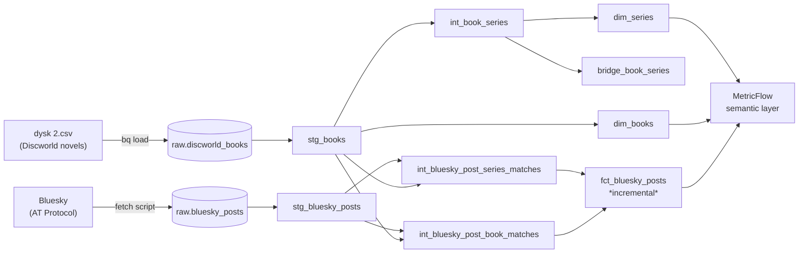

# dbt-pratchett

An end-to-end analytics engineering project on **BigQuery**: it models the 41 Discworld novels alongside **live Bluesky posts** that mention Discworld or Terry Pratchett, then exposes the result through a **MetricFlow semantic layer** — all developed in GitHub through branches, pull requests, and CI.

## Skills applied

**1. Hands-on dbt** — structure, tests, macros, docs, incremental models. A layered staging → intermediate → marts project; **4 reusable macros**; **27 tests** (25 generic + 2 singular); model/column docs with doc blocks; an **incremental** fact model (`fct_bluesky_posts`).

**2. Git-based engineering workflow** — branching, PRs, code review, CI/CD. Every milestone shipped as its own PR into a **protected `main`**; PR template + `CONTRIBUTING.md`; **GitHub Actions CI** that runs `dbt build` + tests on every PR as a required check.

**3. A mainstream semantic / metrics layer** — a **MetricFlow** layer: 5 semantic models and 5 metrics (including a ratio metric), queryable from the `mf` CLI with no dbt Cloud dependency.

---

## The data

Two deliberately different sources, kept messy at landing and cleaned in dbt:

- **Discworld novels** — `dysk 2.csv` ([Kaggle](https://www.kaggle.com/datasets/weronika3piotrowska/discworld-list)): 41 novels with release order, series, and notable facts. The raw file has a shifted-column problem (some years land in the wrong column) and footnote markers — both fixed in staging.
- **Live Bluesky posts** — pulled via the AT Protocol (`app/ingestion/fetch_bluesky_posts.py`), append-only, searching for Discworld/Pratchett mentions. This is the "live, changing" source that makes the incremental model and the match-rate metric meaningful.

Both land untouched in a `raw` BigQuery dataset (`raw.discworld_books`, `raw.bluesky_posts`).

---

## Architecture



**Layers**

- **staging** — `stg_books`, `stg_bluesky_posts`: light cleanup, one model per source (column-shift fix + forward-filled years + footnote stripping on books; author/dedupe handling on posts).
- **intermediate** — `int_book_series` (tokenizes the compound series string), `int_bluesky_post_book_matches`, `int_bluesky_post_series_matches`.
- **marts** — `dim_books`, `dim_series`, `bridge_book_series` (many-to-many book↔series), and `fct_bluesky_posts`, an **incremental** model keyed on `post_uri` with an `is_incremental()` filter on `created_at`.

**Macros** (`app/dbt_pratchett/macros/`): `clean_whitespace`, `strip_footnotes`, `incremental_lookback`, and a `generate_schema_name` override that gives CI its own isolated dataset.

---

## Semantic layer (MetricFlow)

Five semantic models over the marts, exposing **5 metrics**:

| Metric | Type | Meaning |
| --- | --- | --- |
| `total_posts` | simple | Total Bluesky posts |
| `matched_posts` | simple | Posts matched to at least one book or series |
| `match_rate` | ratio | `matched_posts / total_posts` — a coverage signal |
| `posts_per_book` | simple | Post mentions, grouped by book |
| `posts_per_series` | simple | Post mentions, grouped by series |

Query them locally (MetricFlow reads `~/.dbt/profiles.yml`, so export
`DBT_PROFILES_DIR` first):

```bash
export DBT_PROFILES_DIR=~/.dbt
mf query --metrics posts_per_book --group-by book__book_name --order -posts_per_book
mf query --metrics match_rate
```

---

## CI/CD

Two GitHub Actions workflows:

- **`ci.yml`** — on every pull request into `main`: installs deps, `dbt deps`, `dbt build` (models **and** tests, failing the PR on any error), and `mf validate-configs`. It runs against a **throwaway per-PR BigQuery dataset** (`dbt_ci_pr_<number>`) that is dropped at the end of the run, so CI never touches dev/prod data. It's a **required** status check on protected `main`.
- **`ingest.yml`** — manual (`workflow_dispatch`) trigger that runs the Bluesky fetch to grow the live dataset. Append-only and checkpointed on `MAX(created_at)`, so re-running is safe.

CI uses its own profile at `.github/dbt/profiles.yml` (not `~/.dbt`), and reads the
service-account key from the `BIGQUERY_SA_KEY` secret.

---

## Reproduce from a clean clone

> All `dbt`, `pip`, and `python` commands run from **`app/`** inside its virtual environment.
> The venv is scoped to `app/`, not the repo root.

**1. Python environment**

```bash
cd app
python3 -m venv .venv
source .venv/bin/activate
pip install -r requirements.txt      # dbt-core 1.11, dbt-bigquery, dbt-metricflow, atproto
```

**2. BigQuery credentials** — create a GCP project on the Always-Free tier, a service
account with BigQuery access, and a JSON key. Put a dbt profile at `~/.dbt/profiles.yml`
pointing `dbt_pratchett` at your project via keyfile auth.

**3. Land the raw data**

```bash
# Discworld novels
bq load --autodetect --source_format=CSV raw.discworld_books "../dysk 2.csv"

# Bluesky posts (set BLUESKY_IDENTIFIER / BLUESKY_APP_PASSWORD in app/.env first)
python ingestion/fetch_bluesky_posts.py
```

**4. Build and explore**

```bash
cd dbt_pratchett
dbt deps
dbt build                 # runs all models + all 27 tests
dbt docs generate && dbt docs serve   # full lineage graph in the browser
```

---

## Repo layout

```
.
├── dysk 2.csv                                 # Discworld source data
├── CONTRIBUTING.md                            # git workflow for this repo
├── .github/
│   ├── workflows/{ci.yml, ingest.yml}         # CI + manual ingestion
│   └── dbt/profiles.yml                        # CI-only dbt profile
└── app/
    ├── requirements.txt
    ├── ingestion/fetch_bluesky_posts.py       # the EL / fetch step
    └── dbt_pratchett/                          # the dbt project
        ├── models/{staging,intermediate,marts,semantic}/
        ├── macros/
        └── tests/                              # singular tests
```

---

## Roadmap / Future work

**AI-based post classification (not yet implemented):** matching a Bluesky post to a specific book/series is currently regex/keyword matching in the intermediate match models.
A stronger approach would classify posts with an LLM (e.g. BigQuery ML's `AI.GENERATE` calling Vertex AI Gemini) instead of pattern matching — run once over clean mart-level data.
It's deferred because Vertex AI calls are billed and fall outside the BigQuery free tier the rest of this project relies on.
